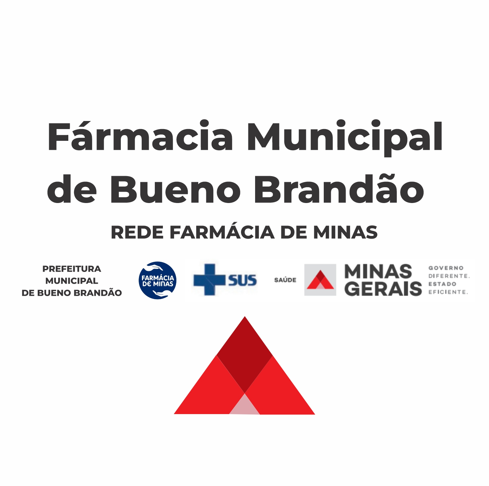

# 🏥 Farmácia Municipal de Bueno Brandão

Sistema web para consulta de medicamentos disponíveis na Farmácia Municipal de Bueno Brandão, parte da **Rede Farmácia de Minas**.



## 📋 Sobre o Projeto

Este sistema permite aos cidadãos consultar rapidamente a disponibilidade de medicamentos na farmácia municipal, oferecendo uma interface moderna e intuitiva para facilitar o acesso à informação.

### ✨ Funcionalidades

- 🔍 **Busca inteligente** com sugestões automáticas
- 📱 **Design responsivo** para desktop e mobile
- 📊 **Visualização em cards ou tabela**
- 📄 **Geração de PDF** com lista completa de medicamentos
- 💬 **Contato direto** via WhatsApp
- 🏷️ **Status em tempo real** dos medicamentos (Disponível, Recém-chegado, Em falta)

### 📊 Dados

- **1.547 medicamentos** catalogados
- **Informações atualizadas** a cada 15 dias
- **Categorias organizadas** por tipo de medicamento

## 🛠️ Tecnologias Utilizadas

- **Frontend**: React 18.3.1 + TypeScript
- **Build Tool**: Vite
- **Styling**: Tailwind CSS + shadcn/ui
- **Roteamento**: React Router Dom
- **Ícones**: Lucide React
- **PDF**: jsPDF + jsPDF-AutoTable

## 🚀 Como Executar

### Pré-requisitos
- Node.js (versão 18 ou superior)
- npm ou yarn

### Instalação

1. Clone o repositório:
```bash
git clone https://github.com/SEU_USUARIO/farmacia-municipal-bueno-brandao.git
cd farmacia-municipal-bueno-brandao
```

2. Instale as dependências:
```bash
npm install
# ou
yarn install
```

3. Execute o projeto:
```bash
npm run dev
# ou
yarn dev
```

4. Acesse no navegador: `http://localhost:5173`

### Build para Produção

```bash
npm run build
# ou
yarn build
```

## 📱 Páginas do Sistema

- **🏠 Início** (`/`) - Busca rápida e informações gerais
- **💊 Lista Completa** (`/medicamentos`) - Todos os medicamentos com filtros
- **ℹ️ Sobre** (`/sobre`) - Informações sobre a farmácia

## 📞 Contato

- **WhatsApp**: (35) 99814-1693
- **Endereço**: Farmácia Municipal de Bueno Brandão
- **Rede**: Farmácia de Minas

## 🤝 Contribuição

Este é um projeto público para benefício da comunidade de Bueno Brandão. Sugestões e melhorias são sempre bem-vindas!

## 📄 Licença

Este projeto está sob a licença MIT. Veja o arquivo [LICENSE](LICENSE) para mais detalhes.

---

**Desenvolvido para a comunidade de Bueno Brandão** 💚
